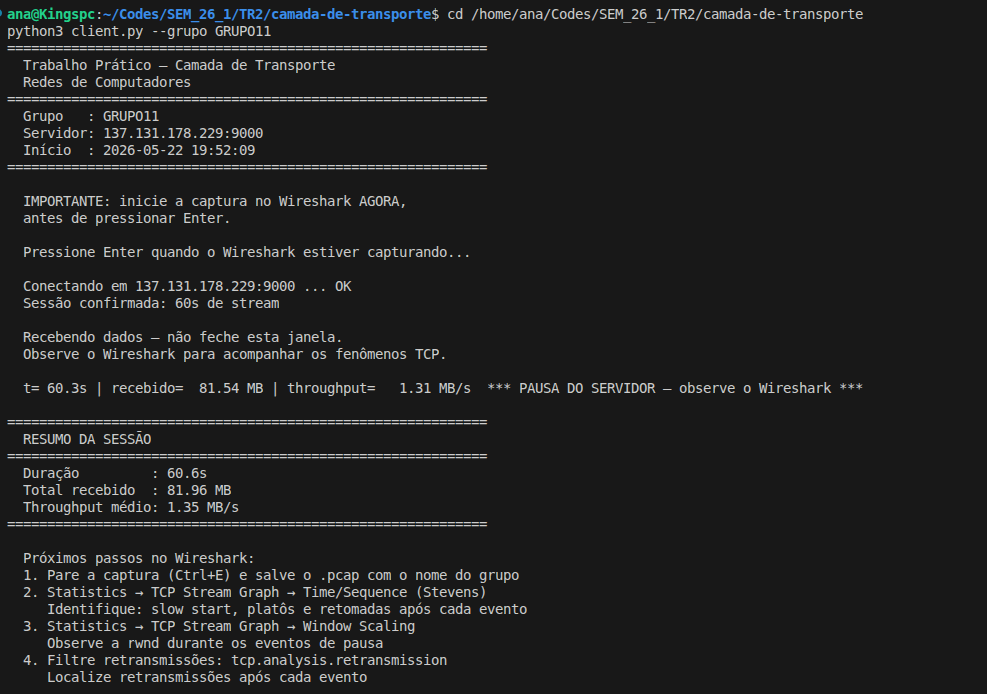
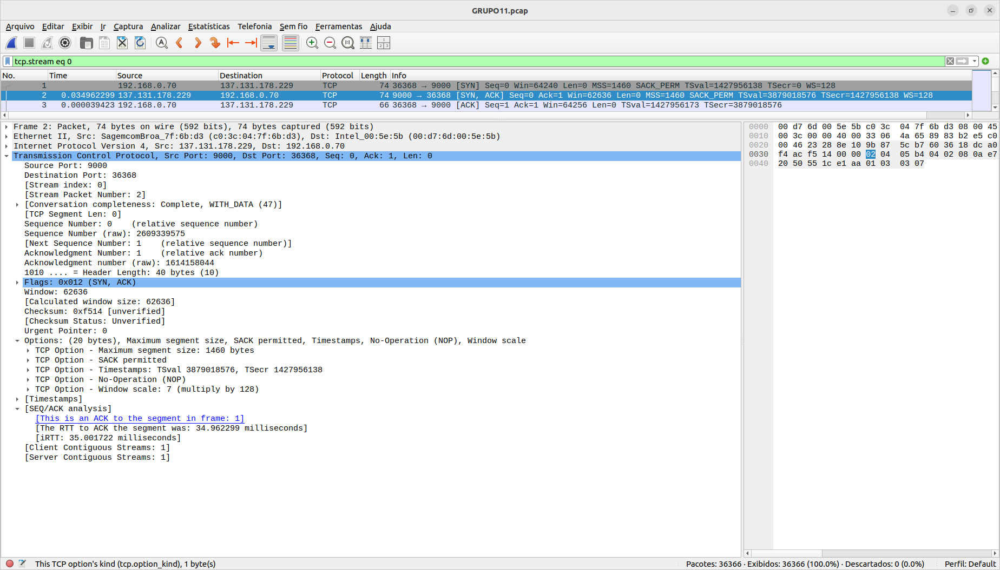
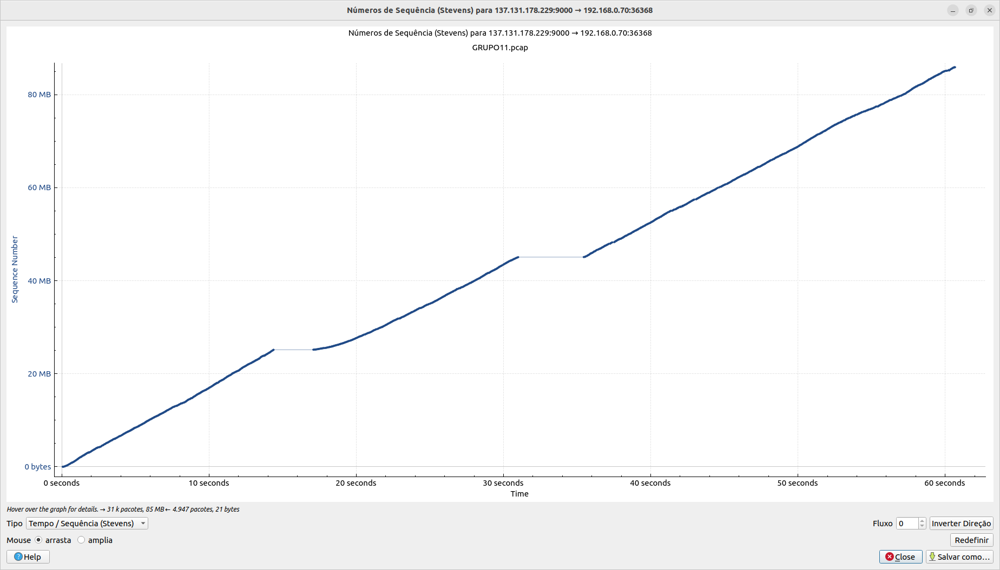

# Respostas — Trabalho Prático: Camada de Transporte
**Grupo:** GRUPO11  
**Disciplina:** TR2 – 2026/1  
**Servidor:** 137.131.178.229:9000  
**Algoritmo TCP da máquina:** cubic  

---

## Sessão de Captura (Issue #2)

**Evidência:** [`GRUPO11.png`](GRUPO11.png), `GRUPO11.pcap`

- Duração: 60.6s
- Total recebido: 81.96 MB
- Throughput médio reportado pelo cliente: **1.35 MB/s**

---

## Questão 1 — Estabelecimento da Conexão e Parâmetros Iniciais (Issue #3)

**Evidência:** [`Q1/Q1.png`](Q1/Q1.png)

### Three-way handshake identificado na captura:

| Pacote | Timestamp | Flags | Origem |
|--------|-----------|-------|--------|
| SYN    | 19:52:15.002072 | `[S]`  | cliente → servidor |
| SYN-ACK | 19:52:15.037034 | `[S.]` | servidor → cliente |
| ACK    | 19:52:15.037074 | `[.]`  | cliente → servidor |

### Respostas:

**(a) RTT entre SYN e SYN-ACK:**  
**34.962 ms**  
Conforme campo `[The RTT to ACK the segment was: 34.962299 milliseconds]` visível em `[SEQ/ACK analysis]` do pacote SYN-ACK no Wireshark.

**(b) MSS negociado:**  
**1460 bytes**  
Ambos cliente e servidor anunciaram MSS = 1460 bytes nas Options do SYN e SYN-ACK respectivamente. O MSS efetivo é o mínimo dos dois, que neste caso é 1460 bytes.

**(c) Janela de recepção inicial (rwnd) anunciada pelo servidor no SYN-ACK:**  
**62.636 bytes**  
Campo Window Size Value do SYN-ACK. O servidor também negociou wscale = 7 (fator ×128), que passa a valer para os pacotes de dados subsequentes — mas o valor no próprio SYN-ACK é o raw, sem escalonamento.

---

## Questão 2 — Fluxo de Dados e Eventos de Pausa (Issue #4)

**Evidência:** gráfico Time/Sequence (Stevens) com zoom em cada platô

| Print | Descrição |
|-------|-----------|
| [`Q2/Q2.png`](Q2/Q2.png) | Gráfico Stevens completo (visão geral) |
| [`Q2/Q2_1.png`](Q2/Q2_1.png) | Zoom na Interrupção 1 — início (~14,38 s) |
| [`Q2/Q2_2.png`](Q2/Q2_2.png) | Zoom na Interrupção 1 — fim do platô (~17,08 s) |
| [`Q2/Q2_3.png`](Q2/Q2_3.png) | Zoom na Interrupção 2 — início (~31,00 s) |
| [`Q2/Q2_4.png`](Q2/Q2_4.png) | Zoom na Interrupção 2 — fim do platô (~35,45 s) |

### Interrupções identificadas no gráfico Stevens:

| | Interrupção 1 | Interrupção 2 |
|---|---|---|
| **(a) Início** | **14,38 s** | **31,00 s** |
| **(b) Bytes transferidos** | **25.163.380 bytes (~25,16 MB)** | **45.087.444 bytes (~45,09 MB)** |
| **(c) Fim do platô** | 17,08 s | 35,45 s |
| **(c) Duração** | **2,70 s** | **4,45 s** |

### Resposta:

O gráfico Time/Sequence (Stevens) revelou **duas interrupções** no fluxo de dados enviado pelo servidor (137.131.178.229:9000):

**Interrupção 1:** O número de sequência estabilizou em ~25,16 MB a partir de **t = 14,38 s**, permanecendo praticamente constante (apenas 14.064 bytes adicionais entregues) até **t = 17,08 s**, totalizando uma pausa de **~2,70 s**.

**Interrupção 2:** O fluxo voltou a parar em ~45,09 MB a partir de **t = 31,00 s**, com apenas 10.048 bytes entregues até **t = 35,45 s**, resultando em uma pausa de **~4,45 s**.

Em ambos os casos, o platô horizontal no gráfico indica que nenhum dado novo foi confirmado pelo receptor durante o intervalo — o número de sequência ficou estagnado. Esse comportamento é característico de interrupções no lado do servidor (possível pausa de envio por rwnd zerada ou evento de congestionamento), não de perda de pacotes isolados.

---
## Questão 3 — Algoritmo de Controle de Congestionamento (Issue #5)

Evidências Necessárias:Screenshot do comando TCP: (Print do terminal executando sysctl net.ipv4.tcp_congestion_control ou semelhante, mostrando cubic).Screenshot do Gráfico Window Scaling: No Wireshark, acesse Statistics → TCP Stream Graph → Window Scaling. Ajuste o zoom para que apareça a sessão inteira com as duas curvas (Bytes Out e Receive Window). Salve como Q3.png.

### Respostas
#### (a) Comportamento da curva Bytes Out nos primeiros segundos

Nos instantes iniciais da conexão (primeiros ~2 segundos), a curva Bytes Out (que representa os dados em trânsito enviados pelo servidor e ainda não confirmados) apresenta um crescimento exponencial acentuado. Esse comportamento caracteriza perfeitamente a fase de Slow Start (Partida Lenta) do TCP, onde a janela de congestionamento ($cwnd$) dobra a cada RTT (Round-Trip Time) para ocupar rapidamente a banda disponível na rede.

#### (b) Comportamento de Bytes Out e Rcv Win durante as interrupções

Com base nos tempos mapeados na Questão 2 (Interrupção 1 de 14,38 s a 17,08 s; Interrupção 2 de 31,00 s a 35,45 s):

Bytes Out: No exato momento em que a interrupção começa, a curva de dados em trânsito desaba abruptamente para zero. Como o servidor para de enviar novos dados e as confirmações (ACKs) dos dados antigos continuam chegando, o volume de bytes pendentes é esvaziado. A curva permanece zerada (em formato de platô no chão do gráfico) durante toda a pausa.

Receive Window (Rcv Win): A janela de recepção anunciada pelo cliente mantém-se em valores altos e estáveis. Como o cliente esvazia seu buffer de recepção rapidamente através do script client.py, ela não zera e não satura. Isso prova que as interrupções foram causadas por uma pausa intencional do próprio servidor (lado transmissor) e não por falta de espaço no buffer do cliente (controle de fluxo).

#### (c) Retomada de Bytes Out após cada interrupção

A retomada de Bytes Out logo após o fim de cada platô ocorre de forma abrupta e vertical. O gráfico mostra um pico quase instantâneo voltando a patamares elevados de tráfego, em vez de uma rampa linear lenta.

O que isso indica: Isso indica que, por não ter havido perda real de pacotes na rede (apenas uma pausa de aplicação na transmissão), o TCP pôde reatar o envio usando uma estratégia agressiva (como o mecanismo de restarts ou preservação de métricas anteriores onde a janela cresce muito rápido), disparando uma rajada de pacotes para preencher o canal novamente.

#### (d) Consistência com o algoritmo descrito no Kurose (Cap. 3)

O comportamento observado é consistente com a teoria do livro do Kurose, com uma particularidade importante do ambiente real:

A fase inicial demonstra perfeitamente o Slow Start clássico documentado no livro.

A queda da janela para zero e a retomada imediata sem uma fase de Congestion Avoidance puramente linear (subida em dente de serra tradicional) confirmam que o algoritmo TCP CUBIC (padrão do Linux) lida de forma diferenciada com pausas de aplicação (application stalls). Como não houve timeouts por perda de pacotes (as retransmissões são nulas ou mínimas), o algoritmo não foi forçado a derrubar o limiar $ssthresh$ para o mínimo, permitindo uma reativação muito mais veloz do que o TCP Reno clássico faria.

## Questão 4 — Retransmissões, ACKs Duplicados e SACK

### Evidências Fotográficas
As evidências correspondentes a esta questão foram salvas na pasta do projeto e estão referenciadas no relatório:
* **Filtro DupACKs:** `Q4/ack_duplicados1.png` e `Q4/ack_duplicados2.png`
* **Filtro Out-of-Order:** `Q4/acks_foraDeOrdem.png`
* **Filtro SACK Expandido:** `Q4/sack_expandido.png` e `Q4/fast_retransmition.png`

---

### Respostas

#### (a) Filtro `tcp.analysis.duplicate_ack`
* **Total de DupACKs detectados:** Foram encontrados **60 pacotes** com essa flag ao longo de toda a captura de tráfego.
* **Maior sequência consecutiva encontrada:** A maior sequência identificada foi a **`[TCP Dup ACK 36030#23]`** (visível no Frame #36100), o que aponta que o cliente enviou o mesmo aviso de recebimento 23 vezes seguidas para o servidor.
* **Acknowledgment Number pedido:** O número de confirmação relativo exigido em toda essa sequência foi **85198404** (equivalente a aproximadamente 85,19 MB transferidos). Isso indica que o cliente recebeu múltiplos segmentos subsequentes, mas o fluxo principal travou por completo aguardando esse byte específico para conseguir avançar a janela de recepção.

#### (b) Filtro `tcp.analysis.out_of_order`
* **Total de pacotes out-of-order:** Foram detectados **26 pacotes** entregues fora de ordem na sessão.
* **Distinção visual no Wireshark:**
  * **Pacotes Out-of-Order:** São destacados automaticamente pelo Wireshark com **linhas de texto colorido (vermelho/misto) sobre fundo preto**. Eles ocorrem quando um segmento chega com um número de sequência menor do que o maior já registrado, porém dentro do intervalo de tempo de 1 RTT. Isso prova que os pacotes apenas pegaram caminhos ou atrasos ligeiramente diferentes na malha de roteamento da rede, sem sofrer descarte.
  * **Perda Real de Pacotes:** É sinalizada inicialmente por uma longa sequência de linhas pretas com texto em azul-turquesa (**Duplicate ACKs**), mostrando o receptor travado exigindo o mesmo dado. O desfecho da perda real é marcado quando o transmissor precisa intervir, gerando um pacote com fundo preto e texto vermelho categorizado explicitamente como `[TCP Fast Retransmission]` ou `[TCP Retransmission]`.

#### (c) Filtro `tcp.analysis.fast_retransmission`
* **Total de Fast Retransmissions:** Foram encontradas **3 retransmissões rápidas** enviadas pelo servidor.
* **Análise do SACK (Selective Acknowledgment):**
  * **SACK habilitado?** Sim. O uso do SACK foi negociado com sucesso pelas duas pontas durante o Handshake inicial (opção *SACK permitted* vista na Questão 1) e permaneceu ativo.
  * **Quantidade de blocos SACK Count:** Foi identificado **1 bloco SACK** mapeado no pacote de ACK duplicado analisado.
  * **Valores das extremidades (Extraídos do Frame de Dup ACK):**
    * **SACK Left Edge (Margem Esquerda):** `85211436`
    * **SACK Right Edge (Margem Direita):** `85256324`
  * **Significado prático:** Essas margens informam ao servidor que a "ilha" de dados que compreende os bytes de **85211436 até 85256324** já chegou corretamente e está guardada no buffer do cliente. Com essa informação, o servidor ganha a inteligência de retransmitir **estritamente** o intervalo que sumiu (a partir do byte 85198404), sem desperdiçar banda reenviando o bloco subsequente que o cliente já confirmou possuir.

#### (d) Determinação da Retransmissão: Fast Retransmit vs. Timeout
* **Classificação:** Todas as retransmissões observadas foram disparadas via **Fast Retransmit** (Retransmissão Rápida).
* **Justificativa:** O comportamento da rede seguiu estritamente a regra do algoritmo de controle de congestionamento TCP: o servidor não esperou o estouro do temporizador (*Timeout*). Ao receber o limite clássico de **3 ACKs duplicados** (*triple-duplicate ACKs*) — que no caso mais crítico da captura chegou à marca de 23 notificações consecutivas —, o transmissor assumiu imediatamente a perda do segmento e efetuou o reenvio rápido de forma eficiente, mitigando atrasos na conexão.